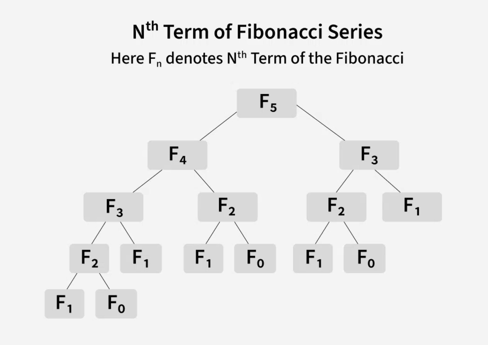
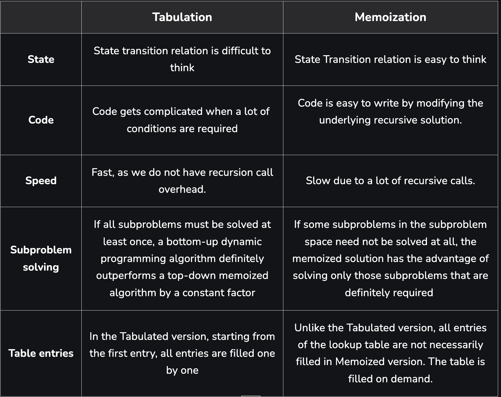

### Memoization
- Top-down approach
- Stores the results of function calls in a table.
- **Recursive** implementation
- Entries are filled when needed.
### Tabulation
- Bottom-up approach
- Stores the results of subproblems in a table
- **Iterative** implementation
- Entries are filled in a bottom-up manner from the smallest size to the final size.

???+ abstract "Differences"
    Memoization(**Recursive**): *$F_{5}$* to *$F_{0}$* and *$F_{1}$*
    Tabulation(**Iterative**): *$F_{0}$* and *$F_{1}$* to *$F_{5}$*

#### Example: Rod Cutting Problem.

[Memoization vs Tabulation](https://www.geeksforgeeks.org/dsa/tabulation-vs-memoization/)

