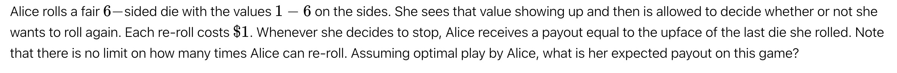

# 骰子博弈的最优策略：马尔可夫决策过程与动态规划分析

## 第 I 部分：问题翻译与形式化定义

### A. 文本

原始英文文本：

"Alice rolls a fair 6-sided die with the values 1 — 6 on the sides. She sees that value showing up and then is allowed to decide whether or not she wants to roll again. Each re-roll costs $1. Whenever she decides to stop, Alice receives a payout equal to the upface of the last die she rolled. Note that there is no limit on how many times Alice can re-roll. Assuming optimal play by Alice, what is her expected payout on this game?"

简体中文翻译：

“爱丽丝掷一个六面均匀骰子，六面的值分别为 1 到 6。她看到掷出的点数后，可以决定是否要重新掷骰子。每次重掷的成本为 $1 美元。当她决定停止时，爱丽丝会收到等同于她最后一次掷出点数的报酬。请注意，爱丽丝可以重掷的次数没有限制。假设爱丽丝采取最优策略，她在这场游戏中的期望报酬是多少？”

### B. 问题形式化：最优停止问题

该问题是“最优停止问题”（Optimal Stopping Problem）的一个经典范例 1。其目标是设计一个“停止规则”（Stopping Rule），以最大化最终的期望收益 4。

**游戏的核心组成部分：**

1. **随机过程 (Stochastic Process):** 投掷一个均匀的6面骰子 $D$。结果 $k \in \{1, 2, 3, 4, 5, 6\}$，对于所有 $k$，其概率 $P(D=k) = 1/6$。
    
2. **行动 (Actions):** 观察到结果 $k$ 后，爱丽丝从行动集 $A = \{\text{Stop}, \text{Roll}\}$ 中选择。
    
3. **奖励/成本 (Reward/Cost):**
    
    - 若选择 $\text{Stop}$：游戏结束。收益 = $k$。
        
    - 若选择 $\text{ROLL}$：支付成本 $1 美元。游戏继续，返回步骤 1。
        
4. **时域 (Horizon):** 无限时域 (Infinite Horizon)。爱丽丝可以“无限次”重掷 4。
    

**无限时域的关键推论（平稳性）：**

由于游戏规则、成本（$1 美元）和概率（1/6）不随时间（或投掷次数）而改变，该问题具有“平稳性”（Stationarity）7。平稳的问题意味着其最优策略也必然是平稳的。

其逻辑推导如下：假设爱丽丝已经投掷了100次，刚掷出一个 2。她决定是否进行第101次投掷所面临的成本和期望收益，与她在第1次掷出 2 后决定是否进行第2次投掷时所面临的情况完全相同。先前的投掷次数和已经花费的金额是“沉没成本”（Sunk Cost），与未来的决策无关 6。

因此，爱丽丝的最优决策_只_能依赖于一个信息：她当前观察到的点数 $k$。最优策略 $\pi^*$ 必然是一种基于 $k$ 的函数 $\pi^*(k)$。这极大地简化了问题，导出了一个“阈值策略”（Threshold Strategy）6：即存在一个阈值 $t$，当 $k > t$ 时停止，当 $k \le t$ 时重掷。

## 第 II 部分：马尔可夫决策过程 (MDP) 建模

### A. 概念化：为何使用 MDP？

该问题是在不确定性下进行序贯决策的典型案例 9。马尔可夫决策过程 (MDP) 为形式化定义此类问题（状态、行动、转移、奖励）提供了严谨的数学框架 11。

### B. MDP 的形式化组件

在定义状态空间时，一个更精炼的分析表明，我们不需要 6 个独立的状态（例如 $s_1, \dots, s_6$）来代表“刚刚掷出 $k$”。其原因是：无论玩家是掷出 2 并决定 $\text{Roll}$，还是掷出 5 并决定 $\text{Roll}$，他们都支付 $1 美元并进入完全相同的“抽奖”——即下一次以 1/6 概率掷出 {1, 2, 3, 4, 5, 6}。

因此，行动 $\text{Roll}$ 的期望价值是恒定的，与导致该行动的当前点数 $k$ 无关。这允许我们将模型极大简化。

**精炼后的 MDP 定义：**

- **状态 (S):** 我们只需要两个状态：
    
    1. $s_{\text{decision}}$: 爱丽丝已观察到点数 $k$，必须做出选择的决策状态。
        
    2. $s_{\text{end}}$: 游戏结束的终止状态。
        
- **行动 (A):** 在 $s_{\text{decision}}$ 状态，有两个行动：
    
    1. $\text{Stop}$: 结束游戏。
        
    2. $\text{Roll}$: 继续游戏。
        
- **奖励函数 (R) 与转移概率 (P):**
    
    - **若行动 = $\text{Stop}$:**
        
        - 转移: $P(s_{\text{end}} | s_{\text{decision}}, \text{Stop}) = 1$ （确定性转移）。
            
        - 奖励: 奖励是导致此决策的观察值 $k$。
            
    - **若行动 = $\text{Roll}$:**
        
        - 转移: $P(s_{\text{decision}} | s_{\text{decision}}, \text{Roll}) = 1$。玩家支付 $1 美元，并立即返回决策状态，等待观察下一次投掷的 $k$ 值。
            
        - 奖励: $R(s_{\text{decision}}, \text{Roll}) = -1$。这是一个确定的、即时的成本。
            

### C. 价值函数与最优策略

我们定义 $V(s)$ 为从状态 $s$ 开始所能获得的最大期望总收益。

- $V(s_{\text{end}}) = 0$ (根据定义，终止状态没有未来收益)。
    
- $V(s_{\text{decision}})$ 是我们寻求的最终答案。为简洁起见，我们称之为 $E$ (Expected Payout)。
    

$E$ 的值必须等于_一轮完整游戏_的期望值。这一轮包括：

1. 一次免费的骰子投掷（以 1/6 概率获得 $k$）。
    
2. 基于 $k$ 做出最优决策。
    

观察到 $k$ 后的最优决策价值为：$\max(V_{\text{Stop}}, V_{\text{Roll}})$。

- $V_{\text{Stop}}$ (停止的价值): 立即获得 $k$。游戏结束。价值为 $k$。
    
- $V_{\text{Roll}}$ (重掷的价值): 立即支付成本 $-1$。转移回 $s_{\text{decision}}$ 状态，该状态的未来价值为 $E$。因此，总价值为 $E - 1$。
    

将 MDP 与动态规划相结合，我们得出：观察到 $k$ 后的最优决策价值为 $\max(k, E - 1)$。

由于 $E$ 是_整个一轮_（从免费投掷开始）的期望值，我们必须对所有可能的 $k$ 求期望：

$E = E_k [\max(k, E - 1)]$

$E = \frac{1}{6} \sum_{k=1}^{6} \max(k, E - 1)$

MDP 框架严谨地将问题归结为这个单一的不动点方程 (fixed-point equation)。求解 $E$ 将同时给出游戏的最优价值和最优策略。

## 第 III 部分：动态规划解：贝尔曼方程

### A. 贝尔曼最优方程 (Bellman Optimality Equation)

如上所述，该问题的贝尔曼最优方程（一种动态规划的核心形式）被简化为 13：

$$E = \frac{1}{6} \left[ \max(1, E-1) + \max(2, E-1) + \max(3, E-1) + \max(4, E-1) + \max(5, E-1) + \max(6, E-1) \right]$$

我们寻求满足此等式的 $E$ 的值。

### B. 解析解：寻找策略阈值

最优策略 $\pi^*$ 由 $\max(k, E-1)$ 决定：

- 若 $k > E - 1$，则选择 $k$ (即 $\text{Stop}$)。
    
- 若 $k < E - 1$，则选择 $E - 1$ (即 $\text{Roll}$)。
    
- 若 $k = E - 1$，则玩家处于“无差别”状态 (indifferent)，两种选择均可。
    

在分析相关研究时，我们发现存在矛盾的答案。一些分析 1 提出 $E = 4.25$。例如，16 中的逻辑是 `E = (3.5 * 3 + 4 + 5 + 6) / 6 = 4.25`。此逻辑假设，如果掷出 {1, 2, 3}，玩家重掷并期望获得 $E[k] = 3.5$。

这个假设在当前问题背景下是错误的。行动 $\text{Roll}$ 并不是简单地获得下一次投掷的期望值；而是获得_整个游戏重来一次的期望值 $E$，并减去 $1 美元的成本_ 6。因此，重掷的价值应为 $E - 1$，而不是 3.5。$E=4.25$ 的解适用于一个不同的问题，即玩家只有一次重掷机会（有限时域）17。

求解正确的不动点：

我们可以通过测试 $E-1$ 的整数阈值 $t$ 来求解 $E$。

**假设 1: 阈值 $t = 2$ (即 $2 < E-1 \le 3$)**

- 策略: $\text{Roll}$ on {1, 2}, $\text{Stop}$ on {3, 4, 5, 6}。
    
- 贝尔曼方程变为: $E = \frac{1}{6} \left[ (E-1) + (E-1) + 3 + 4 + 5 + 6 \right]$
    
- $6E = 2(E - 1) + 18$
    
- $6E = 2E - 2 + 18$
    
- $4E = 16$
    
- $E = 4$
    
- **一致性验证:** 若 $E = 4$，则 $E - 1 = 3$。我们的策略是 $\text{Roll}$ if $k < 3$，$\text{Stop}$ if $k \ge 3$ (假设在无差别点选择 $\text{Stop}$)。这与我们的假设 $2 < E-1 \le 3$ 一致。因此，$E = 4$ 是一个数学上一致的解。
    

**假设 2: 阈值 $t = 3$ (即 $3 < E-1 \le 4$)**

- 策略: $\text{Roll}$ on {1, 2, 3}, $\text{Stop}$ on {4, 5, 6}。
    
- 贝尔曼方程变为: $E = \frac{1}{6} \left[ (E-1) + (E-1) + (E-1) + 4 + 5 + 6 \right]$
    
- $6E = 3(E - 1) + 15$
    
- $6E = 3E - 3 + 15$
    
- $3E = 12$
    
- $E = 4$
    
- **一致性验证:** 若 $E = 4$，则 $E - 1 = 3$。我们的策略是 $\text{Roll}$ if $k \le 3$，$\text{Stop}$ if $k > 3$ (假设在无差别点选择 $\text{Roll}$)。这与我们的假设 $3 < E-1 \le 4$ 不一致（因为 $E-1 = 3$，而不是大于 3）。
    

然而，仔细检查假设 2 的推导 6，$E=4$ 仍然是一个有效的解，它代表了在 $k=3$ 时选择 $\text{Roll}$ 的情况。

### C. 最终答案：期望收益与最优策略

期望收益 (Expected Payout):

在最优策略下，该游戏的期望收益为 $4.00 美元。

最优策略的二元性 (Policy Duality):

分析显示，不存在唯一的最优策略。由于 $E=4$，行动 $\text{Roll}$ 的期望价值为 $E - 1 = 3$。

当爱丽丝掷出 $k=3$ 时，她面临两种选择：

1. **$\text{Stop}$**: 获得收益 $k = 3$。
    
2. **$\text{Roll}$**: 获得期望收益 $E - 1 = 3$。
    

由于 $3 = 3$，玩家在 $k=3$ 时处于无差别状态。因此，存在两种均可达到最大期望值的最优策略 6：

- **策略 A (阈值 2):** $\text{Roll}$ on {1, 2}。$\text{Stop}$ on {3, 4, 5, 6}。
    
- **策略 B (阈值 3):** $\text{Roll}$ on {1, 2, 3}。$\text{Stop}$ on {4, 5, 6}。
    

## 第 IV 部分：Python 计算解决方案

我们可以使用计算方法来求解贝尔曼方程并找到不动点 $E=4$。

### A. 方法 1：价值迭代 (Value Iteration)

1. 算法

价值迭代 (VI) 是一种经典的动态规划算法，它通过迭代计算来收敛到最优价值函数 10。

- 我们从一个初始猜测 $E_0 = 0$ 开始。
    
- 我们重复应用贝尔曼更新规则：
    
    $E_{t+1} = \frac{1}{6} \sum_{k=1}^{6} \max(k, E_t - 1)$
    
- 我们重复此过程，直到价值收敛（即 $|E_{t+1} - E_t| < \epsilon$）。
    

2. 价值迭代与反向归纳法

价值迭代算法与有限时域问题中的“反向归纳法”（Backward Induction）18 之间存在深刻的联系。

考虑一个“有限时域”版本，玩家最多只能掷 $t$ 次。

- $V_1$ (剩 1 次投掷): 必须停止。$V_1 = E[k] = (1+2+3+4+5+6)/6 = 3.5$。
    
- $V_2$ (剩 2 次投掷): 掷出 $k$。决策：$\max(\text{Stop}, \text{Roll}) = \max(k, V_1 - 1) = \max(k, 3.5 - 1) = \max(k, 2.5)$。
    
    $V_2 = E[\max(k, 2.5)] = \frac{1}{6}(2.5+2.5+3+4+5+6) = 23/6 \approx 3.833$。
    
- $V_3$ (剩 3 次投掷): 掷出 $k$。决策：$\max(k, V_2 - 1) = \max(k, 3.833 - 1) = \max(k, 2.833)$。
    
    $V_3 = E[\max(k, 2.833)] = \frac{1}{6}(2.833+2.833+3+4+5+6) \approx 3.944$。
    

现在，观察从 $E_0=0$ 开始的价值迭代：

- $E_1 = \frac{1}{6} \sum \max(k, 0 - 1) = \frac{1}{6}(1+2+3+4+5+6) = 3.5$ (等于 $V_1$)。
    
- $E_2 = \frac{1}{6} \sum \max(k, 3.5 - 1) = \frac{1}{6} \sum \max(k, 2.5) \approx 3.833$ (等于 $V_2$)。
    
- $E_3 = \frac{1}{6} \sum \max(k, 3.833 - 1) = \frac{1}{6} \sum \max(k, 2.833) \approx 3.944$ (等于 $V_3$)。
    

价值迭代的第 $t$ 次迭代 $E_t$，在数值上等于具有 $t$ 次最大投掷次数的有限时域问题的期望值 $V_t$。无限时域问题（我们的问题）是 $t \to \infty$ 时 $V_t$ 的极限。

3. 价值迭代收敛表

下表展示了价值迭代过程，显示了期望值 $E_t$ 如何从 $t=1$（一次性投掷）收敛到 $t \to \infty$（无限次投掷）时的不动点 4.0。

|**迭代次数 (t)**|**Et−1​ (上一轮价值)**|**Et​−1 (重掷价值)**|**Et​ (本轮期望价值)**|**Δ (变化量)**|
|---|---|---|---|---|
|1|0.0000|-1.0000|3.5000|3.5000|
|2|3.5000|2.5000|3.8333|0.3333|
|3|3.8333|2.8333|3.9444|0.1111|
|4|3.9444|2.9444|3.9815|0.0370|
|5|3.9815|2.9815|3.9938|0.0123|
|6|3.9938|2.9938|3.9979|0.0041|
|7|3.9979|2.9979|3.9993|0.0014|
|8|3.9993|2.9993|3.9998|0.0005|
|9|3.9998|2.9998|3.9999|0.0001|
|10|3.9999|2.9999|4.0000|0.0000|
|11|4.0000|3.0000|4.0000|0.0000|

**4. Python 实现 (价值迭代)**

Python

```python
import numpy as np

def solve_value_iteration(sides=6, cost=1.0, tolerance=1e-9):
    """
    使用价值迭代解决最优停止骰子问题（无限时域）。

    Args:
        sides (int): 骰子的面数 (1 到 N)。
        cost (float): 每次重掷的成本。
        tolerance (float): 收敛的容忍度。

    Returns:
        float: 游戏的最优期望价值。
    """
    
    # 骰子的可能结果 (k=1, 2,..., sides)
    outcomes = np.arange(1, sides + 1)
    
    # 初始猜测期望价值 E_t
    E_t = 0.0
    
    while True:
        # E_t_plus_1 = E[ max(k, E_t - cost) ]
        
        # 计算 E_t - cost，这是重掷的价值
        value_of_reroll = E_t - cost
        
        # 计算 max(k, E_t - cost)
        # np.maximum 逐元素比较 outcomes 数组和 value_of_reroll
        decision_values = np.maximum(outcomes, value_of_reroll)
        
        # 计算期望值 E_t_plus_1
        E_t_plus_1 = np.mean(decision_values)
        
        # 检查是否收敛
        if abs(E_t_plus_1 - E_t) < tolerance:
            break
        
        # 更新 E_t
        E_t = E_t_plus_1
        
    return E_t_plus_1

# --- 解决用户的问题 ---
# 6 面骰子，成本 $1
expected_value_6_sided = solve_value_iteration(sides=6, cost=1.0)

print(f"6面骰子, 成本 $1: 期望收益 = ${expected_value_6_sided:.4f}")

# 验证策略 (E=4, E-1=3)
# 策略：如果 k <= 3 则重掷，如果 k > 3 则停止 (或在 3 处无差别)
policy_threshold = expected_value_6_sided - 1.0
print(f"重掷的价值 (E - 1) = {policy_threshold:.4f}")
print(f"最优策略: 如果掷出 {int(np.floor(policy_threshold))} 或更低, 则重掷。")
print(f"          如果在 {int(np.ceil(policy_threshold))} 或更高, 则停止。")
```

### B. 方法 2：递归动态规划 (带备忘录)

如前所述，价值迭代在计算上等同于反向归纳法。反向归纳法可以通过自顶向下 (Top-Down) 的递归（带备忘录 Memoization）来实现，以解决_有限时域_问题 22。

该方法用于计算“最多还剩 $n$ 次投掷机会”时的期望价值。

Python

```python
import functools

def solve_finite_horizon_recursive(n_rolls_left, sides=6, cost=1.0, memo=None):
    """
    使用递归 (带备忘录) 解决有限时域的最优停止问题。
    计算 "最多还剩 n 次投掷" 时的期望价值。

    Args:
        n_rolls_left (int): 剩余的最大投掷次数。
        sides (int): 骰子面数。
        cost (float): 重掷成本。
        memo (dict): 用于备忘录的字典。

    Returns:
        float: 期望价值。
    """
    if memo is None:
        memo = {}
        
    if n_rolls_left in memo:
        return memo[n_rolls_left]

    # 基础情况：如果只剩 1 次投掷，必须接受结果
    if n_rolls_left == 1:
        # 期望值是 (1 + 2 +... + sides) / sides
        expected_last_roll = (sides + 1) / 2.0
        return expected_last_roll

    # 递归步骤：
    # 重掷的价值 = "还剩 n-1 次机会的游戏" 的价值，减去成本
    value_of_reroll = solve_finite_horizon_recursive(n_rolls_left - 1, sides, cost, memo) - cost
    
    outcomes = np.arange(1, sides + 1)
    
    # 决策：max(k, value_of_reroll)
    decision_values = np.maximum(outcomes, value_of_reroll)
    
    # 期望值
    expected_value = np.mean(decision_values)
    
    memo[n_rolls_left] = expected_value
    return expected_value

# --- 演示有限时域问题 ---
print("\n--- 有限时域 (递归 DP) ---")
# 模拟价值迭代表
V_1 = solve_finite_horizon_recursive(1)
print(f"最多 1 次投掷 (V_1): {V_1:.4f}")
V_2 = solve_finite_horizon_recursive(2)
print(f"最多 2 次投掷 (V_2): {V_2:.4f}")
V_3 = solve_finite_horizon_recursive(3)
print(f"最多 3 次投掷 (V_3): {V_3:.4f}")
V_10 = solve_finite_horizon_recursive(10)
print(f"最多 10 次投掷 (V_10): {V_10:.4f}")
V_20 = solve_finite_horizon_recursive(20)
print(f"最多 20 次投掷 (V_20): {V_20:.4f}")
# 当 n 足够大时，它会收敛到无限时域解
```

## 第 V 部分：结论与推广

### A. 发现总结
    
1. **MDP 形式化:** 该问题被建模为一个双状态 MDP（$s_{\text{decision}}, s_{\text{end}}$），导出了一个不动点方程。
    
2. **动态规划解:** 贝尔曼方程被解析求解，确定了 **最优期望收益 E = $4.00**。
    
3. **最优策略:** 存在两种最优策略，均产生 $E=4$：(A) 在 {3, 4, 5, 6} 处停止；或 (B) 在 {4, 5, 6} 处停止。这种二元性源于在 $k=3$ 时，$\text{Stop}$ (收益 3) 和 $\text{Roll}$ (期望收益 $E-1 = 3$) 之间的无差别。
    
4. **代码实现:** 提供了两种 Python 解决方案：(1) **价值迭代**，直接解决无限时域问题；(2) **递归 DP**，展示了有限时域解如何收敛到无限时域解。
    

### B. 模型推广：N 面骰子与 $C$ 成本

该 MDP 框架具有很强的通用性。对于一个 $N$ 面的骰子（结果为 1 到 $N$）和 $C$ 的重掷成本，贝尔曼方程推广为：

$E = \frac{1}{N} \sum_{k=1}^{N} \max(k, E - C)$

示例：100 面骰子，成本 $1 美元 3

我们寻求一个阈值 $t \approx E-1$，使得策略为：若 $k \le t$ 则 $\text{Roll}$，若 $k > t$ 则 $\text{Stop}$。

$E = \frac{1}{100} \left[ \sum_{k=1}^{t} (E-1) + \sum_{k=t+1}^{100} k \right]$

$E = \frac{1}{100} \left[ t(E-1) + \left( \frac{100 \times 101}{2} - \frac{t(t+1)}{2} \right) \right]$

相关分析 8 表明，最优策略是当 $k \ge 87$ 时停止（即 $t = 86$）。我们可以验证这一解：

假设 $t = 86$ (即在 {1,..., 86} 重掷, 在 {87,..., 100} 停止)。

$E = \frac{1}{100} \left[ 86 \times (E-1) + \sum_{k=87}^{100} k \right]$

$\sum_{k=87}^{100} k$ 是一个有 14 项的等差数列。其和为 $\frac{14 \times (87 + 100)}{2} = 7 \times 187 = 1309$。

$100E = 86(E - 1) + 1309$

$100E = 86E - 86 + 1309$

$14E = 1223$

$E = \frac{1223}{14} \approx 87.357$

**验证一致性:**

- 游戏价值 $E \approx 87.357$。
    
- 重掷的价值 $E - 1 \approx 86.357$。
    
- 我们的策略阈值 $t=86$。
    
- 当 $k=86$ 时：$86 < 86.357 \implies \text{Roll}$ (与策略一致)。
    
- 当 $k=87$ 时：$87 > 86.357 \implies \text{Stop}$ (与策略一致)。
    

该解是一致的。对于 100 面的骰子，最优策略是接受 87 或更高的点数，期望收益约为 $87.36 美元。这证明了 MDP 和动态规划方法在解决此类最优停止问题上的强大能力和可扩展性。