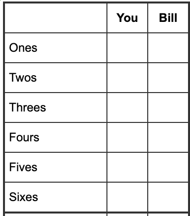

## 要求:


### Rule: 
1. 6 categories 
2. Cannot re-roll

### Purpose
1. What's the optimal strategy.
2. Expectation: Score | Optimal
3. Minimum $\rightarrow$ Simulation 10000 $\rightarrow$ (score, count)柱状图


## 代码方案
```python
import itertools
from functools import lru_cache
from math import factorial
from collections import Counter

# --- 1. 预计算骰子概率与组合 ---

def get_dice_probs(n_dice=5, sides=6):
    """
    生成所有不重复的骰子组合（即不考虑顺序，例如 (1,1,2) 和 (2,1,1) 视为同一种手牌），
    并计算每种手牌出现的概率。
    """
    outcomes = []
    total_combinations = sides ** n_dice
    
    # 使用 combinations_with_replacement 生成所有排序后的手牌
    # 这样大大减少了循环次数 (从 7776 减少到 252 种情况)
    for hand in itertools.combinations_with_replacement(range(1, sides + 1), n_dice):
        counts = Counter(hand)
        # 计算多项式系数 (Multinomial Coefficient)
        # 排列数 = n! / (n1! * n2! * ... * nk!)
        denom = 1
        for c in counts.values():
            denom *= factorial(c)
        num_permutations = factorial(n_dice) // denom
        
        prob = num_permutations / total_combinations
        outcomes.append((hand, prob))
        
    return outcomes

# 获取所有可能的手牌及其概率
ALL_HANDS_AND_PROBS = get_dice_probs()

# --- 2. 计分逻辑 ---

def calculate_score(hand, category_index):
    """
    计算特定手牌在特定格子的得分。
    category_index: 0代表Ones(数一), 1代表Twos(数二)... 5代表Sixes(数六)
    """
    target_num = category_index + 1
    # 得分为：骰子中点数等于 target_num 的总和
    return sum(d for d in hand if d == target_num)

# --- 3. 动态规划 (DP) ---

# 使用 lru_cache 进行记忆化 (Memoization)，避免重复计算相同状态
@lru_cache(maxsize=None)
def get_max_expected_score(mask):
    """
    mask: 一个整数 (0-63)，二进制位表示某个类别是否已填。
          第0位=1 表示 Ones 已填，第5位=1 表示 Sixes 已填。
    返回: 在当前 mask 状态下，剩余回合能获得的【最大期望分数】。
    """
    
    # Base Case: 如果所有6个位都为1 (mask = 111111 binary = 63 decimal)，游戏结束
    if mask == (1 << 6) - 1:
        return 0.0
    
    expected_value = 0.0
    
    # 对于每一种可能的骰子掷出结果 (Chance Node)
    for hand, prob in ALL_HANDS_AND_PROBS:
        
        best_choice_value = -1.0
        
        # 尝试填入每一个还未被填写的格子 (Decision Node)
        for category in range(6):
            # 检查第 category 位是否为 0 (即未填)
            if not (mask & (1 << category)):
                
                # 1. 计算当前这一步的得分
                current_score = calculate_score(hand, category)
                
                # 2. 计算填入该格后的未来状态的期望价值 (递归调用)
                future_mask = mask | (1 << category)
                future_value = get_max_expected_score(future_mask)
                
                # 3. 策略：选择 (当前得分 + 未来期望) 最大的那个格子
                total_value = current_score + future_value
                
                if total_value > best_choice_value:
                    best_choice_value = total_value
        
        # 累加：概率 * 该手牌下的最佳策略价值
        expected_value += prob * best_choice_value
        
    return expected_value

# --- 4. 辅助函数：展示最佳策略 ---

def print_optimal_strategy_example(mask, hand):
    """
    根据计算出的 DP 表，打印特定状态和手牌下的最佳决策
    """
    print(f"\n[策略示例] 当前已填格子掩码: {bin(mask)}, 掷出骰子: {hand}")
    best_cat = -1
    max_val = -1
    
    print(f"{'选项':<10} {'即时得分':<10} {'未来期望':<10} {'总价值':<10}")
    print("-" * 45)
    
    for category in range(6):
        if not (mask & (1 << category)):
            curr = calculate_score(hand, category)
            fut = get_max_expected_score(mask | (1 << category))
            total = curr + fut
            
            cat_name = ["Ones", "Twos", "Threes", "Fours", "Fives", "Sixes"][category]
            print(f"{cat_name:<10} {curr:<10} {fut:<10.4f} {total:<10.4f}")
            
            if total > max_val:
                max_val = total
                best_cat = cat_name
    
    print(f"-> 最佳决策: 填入 [{best_cat}]")

# --- 主程序 ---

if __name__ == "__main__":
    # 计算初始状态 (mask=0) 的最大期望值
    final_expectation = get_max_expected_score(0)
    
    print("="*50)
    print(f"最佳策略下的总分数学期望 (Expectation): {final_expectation:.4f}")
    print("="*50)
    
    # 举例演示策略
    # 假设游戏刚开始，我们掷出了 (2, 2, 5, 5, 6)
    # 直觉可能想填 Fives (10分)，但最佳策略可能为了保留高分项而填 Twos
    print_optimal_strategy_example(0, (2, 2, 5, 5, 6))
```

### 代码详解
#### get_dice_probs()
```python
def get_dice_probs(n_dice=5, sides=6):
    """
    生成所有不重复的骰子组合（即不考虑顺序，例如 (1,1,2) 和 (2,1,1) 视为同一种手牌），
    并计算每种手牌出现的概率。
    """
    outcomes = []
    total_combinations = sides ** n_dice
    
    # 使用 combinations_with_replacement 生成所有排序后的手牌
    # 这样大大减少了循环次数 (从 7776 减少到 252 种情况)
    for hand in itertools.combinations_with_replacement(range(1, sides + 1), n_dice):
        counts = Counter(hand)
        # 计算多项式系数 (ggMultinomial Coefficient)
        # 排列数 = n! / (n1! * n2! * ... * nk!)
        denom = 1
        for c in counts.values():
            denom *= factorial(c)
        num_permutations = factorial(n_dice) // denom
        
        prob = num_permutations / total_combinations
        outcomes.append((hand, prob))
        
    return outcomes
```
这段代码的核心目的是：**高效地计算掷出特定“骰子组合”的概率.**
在概率论和计算机模拟中，处理骰子问题通常有两种方法：
- **暴力法：** 遍历所有排列（$6^5 = 7776$ 种情况），例如 `(1,2,3,4,5)` 和 `(5,4,3,2,1)` 算作两个不同的情况。
- **组合法（这段代码的方法）：** 只遍历“不重复的组合”（252 种情况），例如 `(1,2,3,4,5)`，然后用数学公式算出这个组合包含了多少种排列。(隔板法$\binom{n+k-1}{k}=\binom{10}{5}$)(见 2. Combinatorial Methods)

1. 生成组合(The loop)
```python
for hand in itertools.combinations_with_replacement(range(1, sides + 1), n_dice):
```
- **`combinations_with_replacement`**: 这个函数生成的是“有序且允许重复”的组合。
- 它视 `(1, 2, 3)` 和 `(3, 2, 1)` 为同一种手牌，只返回排序后的一种（通常是 `(1, 2, 3)`）。
- **作用**：它将我们需要遍历的状态空间从 **7776** (即 $6^5$) 压缩到了 **252** 种唯一的“骰型”。

2. 统计重复数字 (Counter)
```python
counts = Counter(hand)
```
- **作用**：统计当前这把手牌里，每个数字出现了几次。
- **例子**：如果手牌是 `(1, 1, 2, 5, 5)`：
    - `counts` 会变成 `{1: 2, 2: 1, 5: 2}` (1出现了2次，2出现了1次，5出现了2次)。
- 这是为了下一步计算排列数做准备。

3. 计算多项式系数 (The Math Core)
```python
denom = 1
for c in counts.values():
    denom *= factorial(c)
num_permutations = factorial(n_dice) // denom
```
这部分是在计算数学上的 **多项式系数 (Multinomial Coefficient)**。这是一个排列组合问题：**“有重复元素的排列问题”**。
- 公式：$$N = \frac{n!}{n_1! \times n_2! \times \dots \times n_k!}$$
    - $n$ 是总骰子数 (5)。
    - $n_i$ 是每个点数重复出现的次数。
    - `factorial(c)` 计算c的阶乘，denom则记录分母
- 为什么要算这个？

    虽然 combinations_with_replacement 只给了我们 (1, 1, 2, 5, 5) 这一次，但在真实的掷骰子过程中，这个组合出现的概率比 (1, 1, 1, 1, 1) 要高得多。
    - `(1, 1, 1, 1, 1)` 只有 **1** 种掷法。
    - `(1, 1, 2, 5, 5)` 可以通过不同的骰子顺序掷出来（例如第一个骰子是2，或者第三个骰子是2）。我们需要算出它有多少种**排列方式**

- **代入例子 `(1, 1, 2, 5, 5)`**：

    - 总数 $n=5$，所以分子是 $5! = 120$。
    - 重复次数：1有2个，2有1个，5有2个。
    - 分母 `denom` = $2! \times 1! \times 2! = 2 \times 1 \times 2 = 4$。
    - **排列数** `num_permutations` = $120 / 4 = 30$。
    - 这意味着在7776种原始结果中，有30种结果对应这个牌型。

4. 计算概率 (Probability)
```python
prob = num_permutations / total_combinations
outcomes.append((hand, prob))
```
- **`total_combinations`**：是 $6^5 = 7776$。
- **`prob`**：该手牌出现的真实概率。
    - 继续上面的例子：`(1, 1, 2, 5, 5)` 的概率是 $30 / 7776 \approx 0.38\%$。
    - 相比之下, `(1, 1, 1, 1, 1)` 的概率是 $1 / 7776 \approx 0.012\%$。

#### DP & get_max_expected_score()
```python
@lru_cache(maxsize=None)
def get_max_expected_score(mask):
    """
    mask: 一个整数 (0-63)，二进制位表示某个类别是否已填。
          第0位=1 表示 Ones 已填，第5位=1 表示 Sixes 已填。
    返回: 在当前 mask 状态下，剩余回合能获得的【最大期望分数】。
    """
    
    # Base Case: 如果所有6个位都为1 (mask = 111111 binary = 63 decimal)，游戏结束
    if mask == (1 << 6) - 1:
        return 0.0
    
    expected_value = 0.0
    
    # 对于每一种可能的骰子掷出结果 (Chance Node)
    for hand, prob in ALL_HANDS_AND_PROBS:
        
        best_choice_value = -1.0
        
        # 尝试填入每一个还未被填写的格子 (Decision Node)
        for category in range(6):
            # 检查第 category 位是否为 0 (即未填)
            if not (mask & (1 << category)):
                
                # 1. 计算当前这一步的得分
                current_score = calculate_score(hand, category)
                
                # 2. 计算填入该格后的未来状态的期望价值 (递归调用)
                future_mask = mask | (1 << category)
                future_value = get_max_expected_score(future_mask)
                
                # 3. 策略：选择 (当前得分 + 未来期望) 最大的那个格子
                total_value = current_score + future_value
                
                if total_value > best_choice_value:
                    best_choice_value = total_value
        
        # 累加：概率 * 该手牌下的最佳策略价值
        expected_value += prob * best_choice_value
        
    return expected_value
```
实现**DP** 的核心逻辑，用于算出在任意游戏状态下，玩家最终能获得的“最大期望分数”。

它的工作原理是**逆向递归（从后往前推）**：如果不算出只剩最后一格怎么填，就算不出剩两格怎么填。
1. 记忆化 (Memoization)
```python
@lru_cache(maxsize=None)
def get_max_expected_score(mask):
```
- **`@lru_cache`**: 这是一个“装饰器”。它的作用是**记笔记**。
    
    - 因为这是一个递归函数，同一个状态（比如 `mask=3`，即填了第一、二格）会被计算很多次。        
    - 如果没有这个装饰器，电脑会重复计算几百万次，速度极慢。有了它，算过一次 `get_max_expected_score(3)` 后，结果就会被存起来，下次直接查表，速度飞快。
        
- **`mask` (状态)**: 用一个整数, 0到63 ($2^{6}\rightarrow$ 6 categories)代表棋盘状态。

    - 这是一个 **位掩码 (Bitmask)** 技巧。
    - 比如二进制 `000101` (十进制5) 代表：第0格（Ones）和第2格（Threes）已经被填了，其他是空的。

2. 终止条件 (Base Case)
```python
if mask == (1 << 6) - 1:
    return 0.0
```
- **`1 << 6`**: 是 $2^6 = 64$ (二进制 `1000000`)。
- **`(1 << 6) - 1`**: 是 63 (二进制 `111111`)。
- **逻辑**：如果 `mask` 是 `111111`，说明6个格子全填满了。
- **返回值**：游戏结束，后面没有额外的分数为 `0.0`。

3. 外层循环：面对随机 (Chance Node)
```python
expected_value = 0.0
for hand, prob in ALL_HANDS_AND_PROBS:
    best_choice_value = -1.0
```
- **逻辑**：现在轮到我们掷骰子了。我们无法控制掷出什么，所以必须遍历**所有可能的骰子组合**（即上一段代码算出的252种情况）。
- **`hand`**: 当前假设掷出的骰子，比如 `(1, 1, 2, 3, 6)`。
- **`prob`**: 掷出这把牌的概率。
- **`best_choice_value`**: 用于记录**在这特定的手牌下**，玩家做出的最聪明决定的价值。

4. 内层循环：做出决策 (Decision Node)
```python
for category in range(6):
        if not (mask & (1 << category)):
```
- **逻辑**：面对手牌 `hand`，玩家要思考：我填哪个格子最好？
- **`mask & (1 << category)`**: 这是一个位运算检查。

    - 意思是：检查 `mask` 的第 `category` 位是不是 1。
	- **`not ...`**: 如果是 0（即这个格子是**空**的），我们才能填。即看现在这个格子填没填。

5. 核心公式 (Bellman Equation)
```python
# 1. 眼前利益
            current_score = calculate_score(hand, category)
            
            # 2. 长远利益 (递归)
            future_mask = mask | (1 << category)
            future_value = get_max_expected_score(future_mask)
            
            # 3. 总价值
            total_value = current_score + future_value
```
- **`current_score`**: 如果我现在把这把牌填在 `category`（比如Twos），我马上能得几分？
- **`future_mask`**: 填完后，棋盘状态就变了（把对应位标记为1）。
- **`future_value`**: **关键点！** 这里调用了函数自己（递归）。它在问：“进入这个新状态后，一直玩到游戏结束，我平均还能再拿多少分？”
- **`total_value`**: 眼前的分 + 未来的期望分。

6. 选择最优解 (Optimization)
```python
if total_value > best_choice_value:
                best_choice_value = total_value
```
- **逻辑**：我们在所有可填的格子中比较。
- 比如填 Ones 总价值 20分，填 Sixes 总价值 25分。作为理性玩家，如果不傻，肯定选价值最高的那个（25分）。
- **`best_choice_value`** 最终锁定了“在这把手牌下，理性的最高收益”。

7. 汇总期望值 (Expectation Aggregation)
```python
expected_value += prob * best_choice_value
return expected_value
```
- **逻辑**：我们刚才算出的是**某一种**手牌下的最高分。但现实中，每种手牌出现的概率不同。
- **期望值公式**：$E = \sum (P_i \times V_i)$
    - 概率 (`prob`) $\times$ 该情况下的最优值 (`best_choice_value`)。
- 把所有252种情况加权累加，就是**当前状态 `mask` 下的最终数学期望**。

#### simulate_one_game():
```python
def simulate_one_game():
    """
    模拟一局完整的游戏
    """
    mask = 0
    total_score = 0
    
    # 游戏共 6 回合
    for _ in range(6):
        # 1. 随机掷骰子 (生成 5 个 1-6 的随机数)
        # 注意：这里模拟真实投掷，所以用 random.choices
        roll = tuple(sorted(random.choices(range(1, 7), k=5)))
        
        # 2. 询问最佳策略
        category = get_optimal_move(mask, roll)
        
        # 3. 执行操作
        score = calculate_score(roll, category)
        total_score += score
        mask |= (1 << category) # 标记该格已填
        
    return total_score
```

1. 初始化游戏状态
```python
mask = 0
total_score = 0
```

2. 游戏循环
```python
for _ in range(6):
   ```
- 游戏规则规定必须填满6个格子，且不能重复填写。
- 因此，游戏**固定进行 6 个回合**。每回合填一个格子，6回合后游戏必然结束。

3. 第一步：随机掷骰子 (Random Roll)
```python
roll = tuple(sorted(random.choices(range(1, 7), k=5)))
```
这是代码中**唯一引入随机性**的地方，模拟了真实的物理世界：

- **`range(1, 7)`**: 代表骰子的6个面 (1, 2, 3, 4, 5, 6)。

- **`random.choices(..., k=5)`**: 从这6个数中随机抽取5次。
    - 注意这里用的是 `choices` (带放回抽样)，因为骰子之间是独立的，可能掷出 `(1, 1, 1, 1, 1)`。
        
- **`sorted(...)`**: **排序是非常关键的一步**。
    - 在我们的 DP 算法中，为了减少计算量，我们将 `(1, 2, 3, 4, 5)` 和 `(5, 4, 3, 2, 1)` 视为同一种手牌（状态）。
    - 为了让模拟器生成的数据能被 DP 算法识别，必须将骰子结果排序成标准格式。
        
- **`tuple(...)`**: 转换为元组，因为元组是不可变的，且通常作为字典或缓存的键（Key）。

4. 第二步：咨询最佳策略
```python
category = get_optimal_move(mask, roll)
```
- **`get_optimal_move`** 会去查询之前计算好的 **DP 表**，对比所有可选格子的（当前得分 + 未来期望），然后告诉模拟器：“**填第 `category` 个格子是数学上最划算的**”。
    - _注意：这里模拟器没有任何思考，它只是无脑执行最优策略。

5. 第三步：执行操作与更新状态
```python
score = calculate_score(roll, category)
total_score += score
mask |= (1 << category)
```
- **算分**：根据当前骰子 `roll` 和选择的 `category` 计算得分。例如骰子是 `(2,2,5,5,5)`，选了 `Fives` (索引4)，得分就是 15 分。
    
- **累加**：把分数加到总分里。
    
- **更新 Mask (重要)**：
    - `1 << category`: 把 1 左移 `category` 位。
        - 如果 `category` 是 0 (Ones)，变成二进制 `000001`。
        - 如果 `category` 是 2 (Threes)，变成二进制 `000100`。
            
    - `mask |= ...` (按位或运算): 把对应位置为 1。
        
    - **例子**：如果当前 `mask` 是 `000001` (已填Ones)，现在填了 Threes (`000100`)，运算后 `mask` 变为 `000101`。这标记了该格子已被占用，下一回合就不能再填了。


