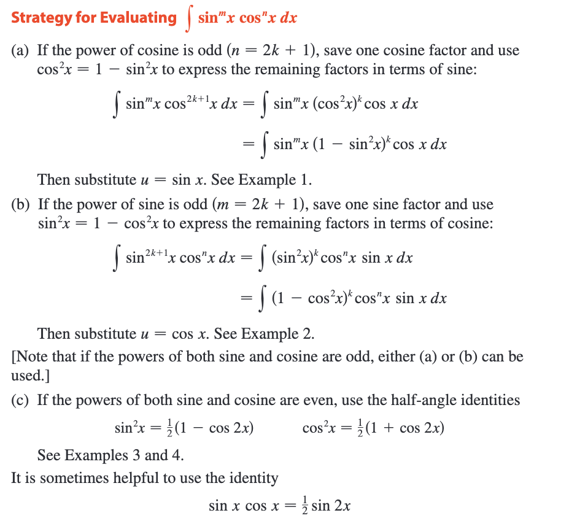
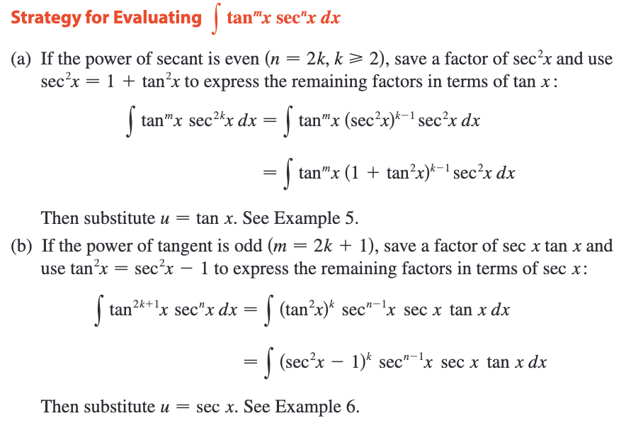
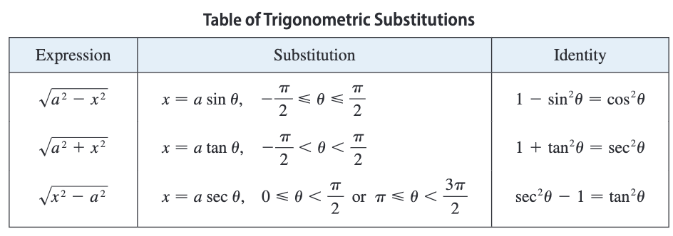
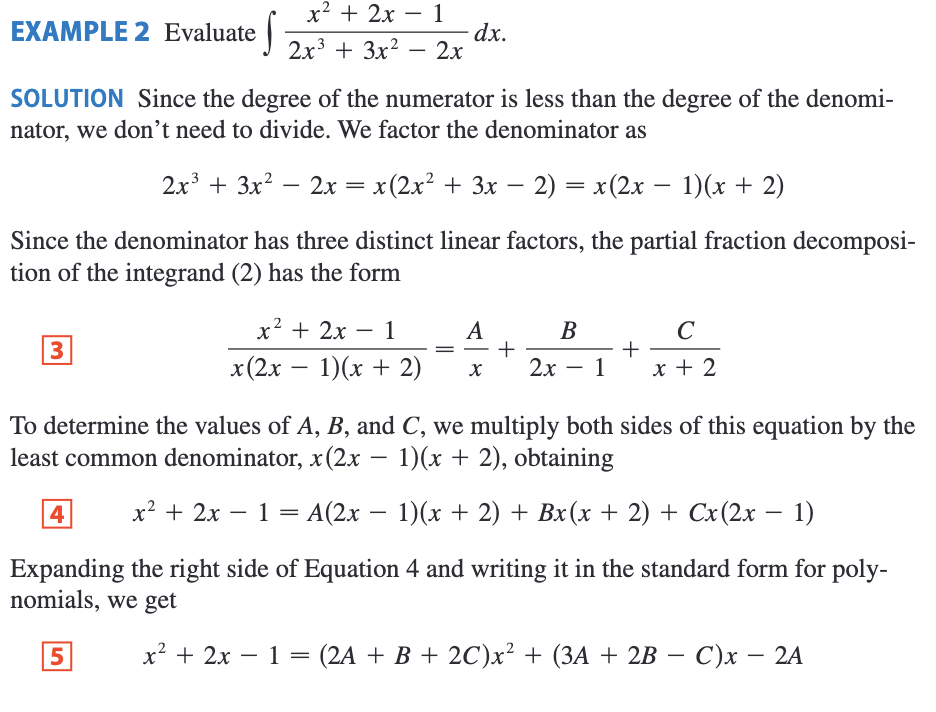
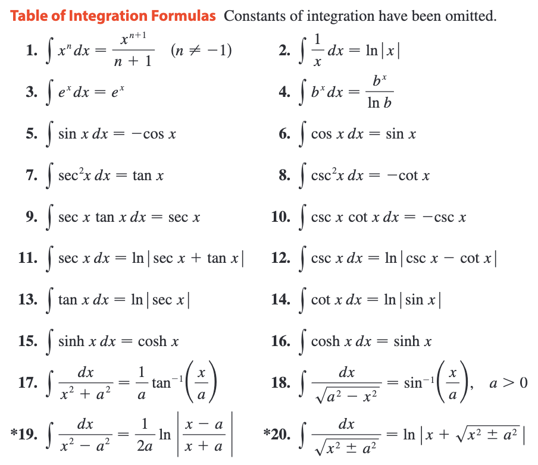

---
tags:
  - math
  - calculus
  - tools
---
## Integration by parts
### Indefinite Integrals

The **Product Rule** states that if f and t are differentiable functions, then $$\frac{d}{dx}[f(x)g(x)]=f(x)g^{'}(x)+f^{'}(x)g(x)$$In the notation for indefinite integrals this equation becomes$$\int[f(x)g^{'}(x)+f^{'}(x)g(x)]dx=f(x)g(x)$$or $$\int f(x)g^{'}(x)dx=f(x)g(x)-\int g(x)f'(x)dx$$so, by the Substitution Rule, the formula for integra- tion"by parts becomes$$\int u\,dv=uv-\int v\,du$$

### Definite Integrals
 $$\int_{a}^{b} f(x)g^{'}(x)dx=f(x)g(x)]_{a}^{b}-\int_{a}^{b} g(x)f'(x)dx$$

## Trigonometric Integrals

### Integrals of Powers of Sine and Cosine

### Integrals of Powers of Secant and Tangent

!!! tip
    For other cases, the guidelines are not as clear-cut. We may need to use **identities**, **integration by parts**, and occasionally a little ingenuity. We will sometimes need to be able to integrate $tan\, x$ by using the formula following, $$\int tan\,x\,dx=ln|sec\,x|+C$$$$\int sec\,x\,dx=ln|sec\,x+tan\,x|+C$$

### Using Product Identities (积化和差)

## Trigonometric Substitution

本质换元

## Integration of Rational Functions by Partial Fractions  (用部分分式法积分有理函数)

### The Method of Partial Fractions
- **A rational function:**$$f(x)=\frac{P(x)}{Q(x)}$$where P and Q are polynomials. It’s possible to express f as a sum of simpler fractions provided that ***the degree of P is less than the degree of Q.*** Such a rational function is called proper. Recall that if$$P(x)=a_{n}x^{n}+a_{n-1}x^{n-1}+...+a_{1}x+a_{0}$$where $a_{n}  \neq 0$, then the degree of P is n and we write $deg(P) = n$.
- If f is **improper**, that is, $deg(P) > deg(Q),$ then we must take the preliminary step of dividing Q into P (by long division) until a remainder $R(x)$ is obtained such that $deg(R)\lt deg(Q)$. The result is$$f(x)=\frac{P(x)}{Q(x)}=S(x)+\frac{R(x)}{Q(x)}$$where S and R are also polynomials.

#### 1. The denominator $Q(x)$ is a product of **distinct linear factors(不同的线性因子).**
- This means$$Q(x)=(a_{1}x+b_{1})(a_{2}x+b_{2})...(a_{i}+b_{i})$$where no factor is repeated (and no factor is a constant multiple of another). In this case the partial fraction theorem states that there exist constants $A_{1}, A_{2}, . . . , A_{k}$ such that$$\frac{R(x)}{Q(x)}=\frac{A_{1}}{a_{1}x+b_{1}}+\frac{A_{2}}{a_{2}x+b_{2}}+...\frac{A_{i}}{a_{i}x+b_{i}}$$
    
- 待定系数得A, B, C

!!! note
    If we put $x = 0$ in Equation 4, then the second and third terms on the right side vanish and the equation then becomes $-2A=-1$, or $A=\frac{1}{2}$. Likewise, $x =\frac{1}{2}$ gives $\frac{5B}{4}=\frac{1}{4}$ and $x=-2$ gives $10C=-1$, so $B=\frac{1}{5}$ and $C=-\frac{1}{10}$. (Object that Equation 3 is not valid for $x = 0, \frac{1}{2}, or\,22$, so why should Equation"4 be valid for those values? In fact, Equation 4 is true for all values of x)

#### 2. $Q(x)$ is a product of linear factors, **some of which are repeated.**
$$\frac{A_{1}}{a_{1}x+b_{1}}+\frac{A_{2}}{(a_{1}x+b_{1})^{2}}+...\frac{A_{r}}{(a_{1}x+b_{1})^{r}}$$***Example:***$$\frac{x^{3}-x+1}{x^{2}(x-1)^{3}}=\frac{A}{x}+\frac{B}{x^{2}}+\frac{C}{x-1}+\frac{D}{(x-1)^{2}}+\frac{E}{(x-1)^{3}}$$
#### 3. $Q(x)$ contains irreducible quadratic factors, none of which is repeated. (包含不重复的不可约二次因子)
$$\frac{Ax+B}{ax^{2}+bx+c}$$***Example:***$$\frac{x}{(x-2)(x^{2}+1)(x^{2}+4)}=\frac{A}{x-2}+\frac{Bx+C}{x^{2}+1}+\frac{Dx+E}{x^{2}+4}$$

!!! tip
    Then use $$\int\frac{dx}{x^{2}+a^{2}}=\frac{1}{a}tan^{-1}(\frac{x}{a})+C$$

#### 4. $Q(x)$ contains a repeated irreducible quadratic factor.
$$\frac{A_{1}x+B_{1}}{ax^{2}+bx+c}+\frac{A_{2}x+B_{2}}{(ax^{2}+bx+c)^{2}}+...+\frac{A_{r}x+B_{r}}{(ax^{2}+bx+c)^{r}}$$***Example:***$$\frac{x^{3}+x^{2}+1}{x(x-1)(x^{2}+x+1)(x^{2}+1)^{3}}=\frac{A}{x}+\frac{B}{x-1}+\frac{Cx+D}{x^{2}+x+1}+\frac{Ex+F}{x^{2}+1}+\frac{Gx+H}{(x^{2}+1)^{2}}+\frac{Ix+J}{(x^{2}+1)^{3}}$$

### Rationalizing Substitutions
- Some non-rational functions can be changed into rational functions by means of appropriate substitutions. In particular, when an integrand contains an expression of the form $\sqrt[n]{g(x)}$, then the substitution $u=\sqrt[n]{g(x)}$ may be effective.

## Strategy for Integration

### Guidelines for Integration
#### 1. **Simplify the Integrand If Possible.**
#### 2. **Look for an Obvious Substitution.**
#### 3. **Classify the Integrand According to Its Form.**
   - ***Trigonometric functions.*** If $f(x)$ is a product of powers of sin x and cos x, of tan x and sec x, or of cot x and csc x, then we use the substitutions. (see [Trigonometric Integrals](#trigonometric-integrals))

   - ***Rational functions.*** (see [Partial Fractions](#integration-of-rational-functions-by-partial-fractions))

   - ***Integration by parts.*** If $f(x)$ is a product of a power of x (or a polynomial) and a transcendental function (such as a trigonometric, exponential, or logarithmic function), then we try integration by parts.

   - ***Radicals.*** Particular kinds of substitutions are recommended when certain radicals appear.
     - If $\sqrt{x^{2}+a^{2}},\sqrt{x^{2}-a^{2}},or\,\sqrt{a^{2}-x^{2}}$ occurs, use a ***trigonometric substitution***.
     - If $\sqrt[n]{ax+b}$ occurs, use the ***rationalizing substitution*** $u=\sqrt[n]{ax+b}$. More generally, this sometimes works for $\sqrt[n]{g(x)}$.
#### 4. **Try again**
If the first three steps have not produced the answer, remember that there are basically only two methods of integration: substitution and parts.
- ***Try substitution.*** Even if no substitution is obvious (Step 2), some inspiration or ingenuity (or even desperation) may suggest an appropriate substitution.

- ***Try parts.*** Although integration by parts is used most of the time on products of the form described in Step 3, it is sometimes effective on *single functions*. It works on $tan^{-1}x, sin^{-1}x, and\; ln \,x$, and these are all *inverse functions.*

- ***Manipulate the integrand.*** Algebraic manipulations (perhaps rationalizing the denominator or using trigonometric identities) may be useful in transforming the integral into an easier form. These manipulations may be more substantial than in Step 1 and may involve some ingenuity. Here is an example:$$\int\frac{dx}{1-cos\,x}=\int\frac{dx}{1-cos\,x}·\frac{1+cos\,x}{1+cos\,x}=\int\frac{1+cos\,x}{sin^{2}x}=\int(csc^{2}x+\frac{cos\,x}{sin^{2}x})dx$$
- ***Relate the problem to previous problems.***

- ***Use several methods.*** Sometimes two or three methods are required to evaluate an integral. The evaluation could involve several successive substitutions of different types, or it might combine integration by parts with one or more substitutions.

### Can We Integrate All Continuous Functions?
The answer is NO, at least not in terms of the functions that we are familiar with. 

The functions that we have been dealing with in this book are called *elementary functions*. These are the polynomials, rational functions, power functions, exponential functions, logarithmic functions, trigonometric and inverse trigonometric functions, hyperbolic and inverse hyperbolic functions, and all functions that can be obtained from these by the !ve operations of addition, subtraction, multiplication, division, and composition.
