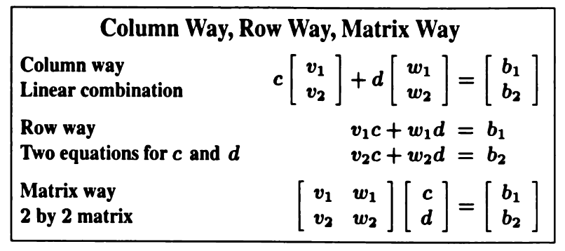
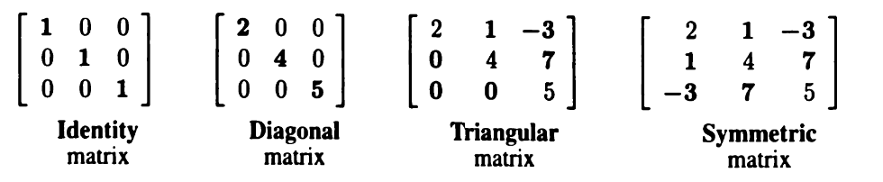
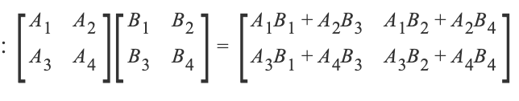

## Vectors and Linear Com binations

### Linear combination $cv + dw$

???+ note "The linear combination"
    The linear combinations of v and w are the vectors cv + dw for all numbers c and d:
    $$c\begin{bmatrix}2\\4\end{bmatrix}+d\begin{bmatrix}1\\3\end{bmatrix}=\begin{bmatrix}2c+1d\\4c+9d\end{bmatrix}$$ fill the $xy$ plane

* Column way与Matrix way很好转化，也是计算和理解Matrix way的常用方法
* Ax is a linear combinations of columns of A.
* 也可以看作几个向量的点乘（dot product）之和.

### Elimination
Elimination **fails** to produce a solution only when the equations don’t have a solution in the first place. This can happen when the vectors v and w lie on the same line through the center point (0,0). Those vectors are not independent.

## Matrices and Their Column Spaces
We have vectors in $R^{2}$ and $R^{3}$ and every $R^{n}$.

### Matrix Multiplication

!!! tip
    (m, n)的值 = A中m行 B中n列对应积之和
    矩阵相乘的顺序有区别
    AB != BA

#### Perspective of Matrices Multiplication
1. element perspective
$$C_{ij}=(row\,i\,of\,A)·(column\,j\,of\,B)=\sum a_{ik}b_{kj}$$
A列数应等于B行数
2. column perspective
3. row perspective
