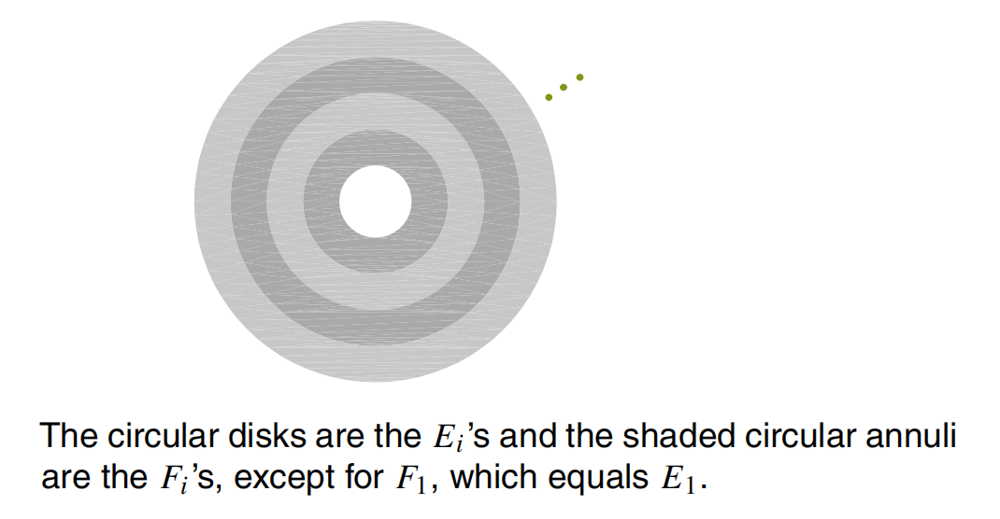

### Sample Space and Events
Commutative laws: 
	E $\cup$ F, EF = FE.
Associative laws:
	E $\cup$ (F $\cup$ G) = (E $\cup$ F ) $\cup$ G, E (FG) = (EF )G.
Distributive laws:
	(EF ) $\cup$ H = (E∪H )(F∪H ), (E∪F )H = (EH )∪(F H )
De Morgan’s first law:
	(E $\cup$ F) = E$^{c}$F$^{c}$, ($\bigcup_{i=1}^{n}$E$_{i}$)$^{c}$ = $\bigcap_{i=1}^{n}$E$_{i}$$^{c}$, ($\bigcup_{i=1}^{\infty}$E$_{i}$)$^{c}$ = $\bigcap_{i=1}^{\infty}$E$_{i}$$^{c}$
De Morgan’s second law:
	(EF)$^{c}$ = E$^{c}$ $\cup$ F$^{c}$, ($\bigcap_{i=1}^{n}$E$_{i}$)$^{c}$ = $\bigcup_{i=1}^{n}$E$_{i}$$^{c}$, ($\bigcap_{i=1}^{\infty}$E$_{i}$)$^{c}$ = $\bigcup_{i=1}^{\infty}$E$_{i}$$^{c}$

!!! note
    E = EF $\cup$ EF$^{c}$

### Axioms of Probability

!!! note "Definition (Probability Axioms)"
    Let S be the sample space of a random phenomenon. Suppose that to each event A of S, a number denoted by P (A) is associated with A. If P satisfies the following axioms, then it is called a probability and the number P (A) is said to be the probability of A.

#### Axiom 1
P(A) $\ge$ 0
#### Axiom 2
P(S) = 1
#### Axiom 3
If {A$_{1}$, A$_{2}$, A$_{3}$,...} is a sequence of mutually exclusive events (i.e., the joint occurrence of every pair of them is impossible: A$_{i}$A$_{j}$ = $\phi$ when i = j ), then
				P($\bigcup_{i=1}^{\infty}$A$_{i}$) = $\sum_{i=1}^{\infty}$P(A$_{i}$).

#### Theorem 1.1
The probability of the empty set  $\phi$ is 0. That is  P($\phi$) = 0.

#### Theorem 1.2
Let{A$_{1}$, A$_{2}$, A$_{3}$,..., A$_{n}$} be a mutually exclusive set of events. Then
				P($\bigcup_{i=1}^{n}$A$_{i}$) = $\sum_{i=1}^{n}$P(A$_{i}$).

#### Theorem 1.3
Let S be the sample space of an experiment. If S has N points that are all equally likely to occur, then for any event A of S,
					P(A) = $\frac{N(A)}{N}$ 
where N(A) is the number of points of A.

#### Theorem 1.4
For any event A, P(A$^{c}$) = 1 - P(A).

#### Theorem 1.5
If A $\subseteq$ B, then
				P(B - A) = P(BA$^{c}$) = P(B) - P(A).

#### Theorem 1.6
(容斥原理）              P(A $\cup$ B) = P(A) + P(B) -  P(AB)
##### Inclusion-Exclusion Principle
P($\bigcup_{i=1}^{n}$A$_{i}$) = $\sum_{i=1}^{n}$P(A$_{i}$) - $\sum_{i=1}^{n-1}$$\sum_{j=i+1}^{n}$P(A$_{i}$A$_{j}$) + 
$\sum_{i=1}^{n-2}$$\sum_{k=i+1}^{n-1}$$\sum_{k=j+1}^{n}$P(A$_{i}$A$_{j}$A$_{k}$) - ... + (-1)$^{n-1}$P(A$_{1}$A$_{2}$...A$_{n}$)

#### Theorem 1.7
P(A) = P(AB) +P(AB$^{c}$)

### Continuity of Probability Functions
#### Theorem 1.8
For any **increasing or decreasing** sequence of events, {E$_{n}$, n $\ge$ 1},
$\lim_{n \to \infty}$ P(E$_{n}$) = P($\lim_{n \to \infty}$E$_{n}$)

