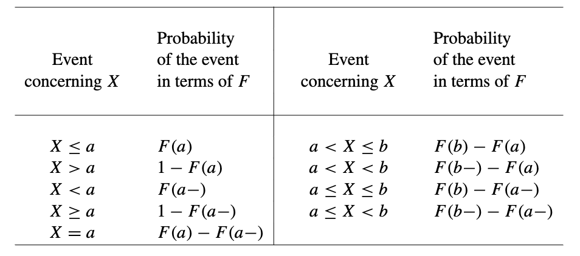
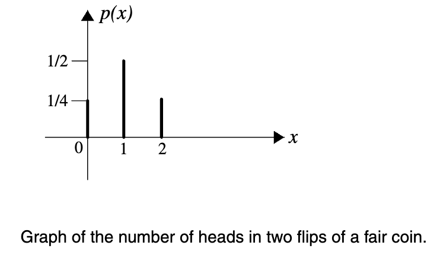
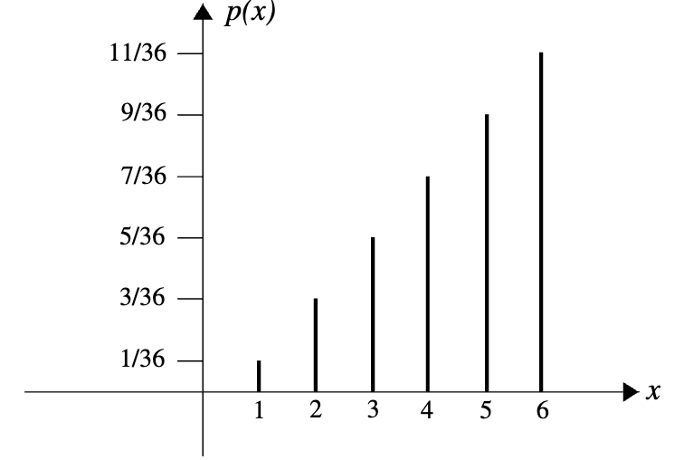
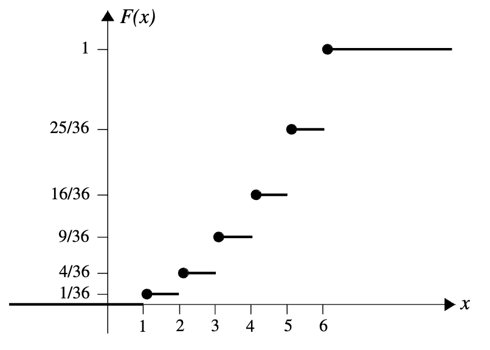
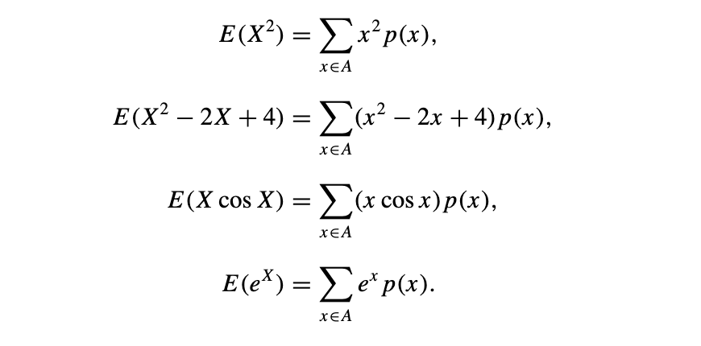
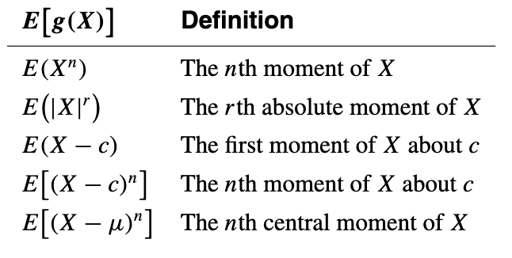

## Random Variables

!!! note "Definition"
    Let S be the sample space of an experiment. A real-valued function $X:S\longrightarrow R$ is called a random variable of the experiment if, for each interval $I\subseteq R$, {$s:X(s)\in I$} is an event.

    In probability, the set {s : X(s) ∈ I } is often abbreviated as {X ∈ I }, or simply as X ∈ I

#### NOTE:
* $X:S\longrightarrow R$ : $X$ 是一个函数，它接受一个来自样本空间 $S$ 的‘输入’（即一个实验结果），并‘输出’一个实数
**实验**：掷一次骰子。
样本空间 $S$**：$\{1, 2, 3, 4, 5, 6\}$。
随机变量 $X$：我们可以定义 $X$ 为“掷出的点数”。
    如果掷出的结果 $s$ 是 3，那么 $X(s) = X(3) = 3$。
    如果掷出的结果 $s$ 是 5，那么 $X(s) = X(5) = 5$。
 $X$ 这个函数把 $\{1, 2, 3, 4, 5, 6\}$ 这些“结果”映射到$\{1, 2, 3, 4, 5, 6\}$ 这些“实数”上。
 * $I\subseteq R$, {$s:X(s)\in I$}: 样本空间 $S$ 中，所有那些能使 $X(s)$ 的值落在区间 $I$ 内的'原始结果 $s$' 所组成的集合
随机变量 $X$ 是掷出的点数。
假设我们关心“点数小于等于3”，那么区间 I 就是 $(-\infty, 3]$。
我们要找的集合就是 ${s : X(s) \in (-\infty, 3]}$.
我们检查 $S = \{1, 2, 3, 4, 5, 6\}$ 中每一个 $s$：
$X(1)=1$，1 属于 $I$ 吗？是。
$X(2) = 2$，2 属于 $I$ 吗？是。
$X(3) = 3$，3 属于 $I$ 吗？是。
$X(4) = 4$，4 属于 $I$ 吗？否。

## Distribution Function

!!! note "Definition"
    If X is a random variable, then the function F defined on
    (−∞, +∞) by F (t) = P (X ≤ t) is called the **distribution function of X**.

Since F “accumulates” all of the probabilities of the values of X up to and including t, sometimes it is called the **cumulative distribution function of X**. The most important properties of the distribution functions are as follows:
1. ***F is nondecreasing***; that is, if $t\lt u$, then $F(t)\le F(u)$.
2. $\lim_{n\to\infty}F(t)=1$. This follows from the continuity property of the probability function (see Theorem 1.8 in [Axioms of Probability](../1. Axioms of Probability/#continuity-of-probability-functions)).
3. $\lim_{n\to-\infty}F(t)=0$.
4. ***F is right continuous***. That is, for every t ∈ R , F (t+) = F (t).

## Discrete Random Variables

### Definitions of Discrete Random Variables

!!! note "Definition1"
    A real-valued function p : R → R , defined by p(x) = P (X = x), is assigned and is called the **probability mass function** of X. (It is also called the probability function of X or the discrete probability function of X.)

!!! note "Definition2"
    The **probability mass function** p of a random variable X whose set of possible values is {$x_{1},x_{2},x_{3}...$} is a function from R to R that satisfies the following properties.

    * $p(x)=0$ if $x\notin \left\{x_{1},x_{2},x_{3},...\right\}$.
    * $p(x_{i})=P(X=x_{i})$ and hence $p(x_{i})\ge 0(i=1,2,3...)$.
    * $\sum_{i=1}^{\infty}p(x_{i})=1$.

The distribution function F of a discrete random variable X, with the set of possible values $\left\{x_{1},x_{2},x_{3},...\right\}$, is a step function. Assuming that $x_{1}\lt x_{2}\lt x_{3}\lt ...$, we have that if $t\lt x_{1}$, then
					$F(t)=0$
if $x_{1}\le t\lt x_{2}$, then
$$F(t)=P(X\le t)=P(X=x_{1})=p(x_{1});$$
if $x_{2}\le t\lt x_{3}$, then
$$F(t)=P(X\le t)=P(X=x_{1}\, or\,X=x_{2})=p(x_{1})+p(x_{2});$$
and in general, if $x_{n-1}\le t\lt x_{n},$ then
$$F(t)=\sum_{i=1}^{n-1}p(x_{i}).$$

### Expectations of Discrete Random Variables

!!! note "Definition"
    The **expected value** of a discrete random variable X with the set of possible values A and probability mass function p(x) is defined by
    $$E(X)=\sum_{x\in A}xp(x).$$
    We say that E(X) exists if this **sum converges absolutely**.
    The expected value of a random variable X is also called the **mean**, or the mathematical expectation, or simply the expectation of X. It is also occasionally denoted by E[X], EX, μX, or μ.

#### Theorem 4.1
If X is a constant random variable, that is, if P (X = c) = 1 for a constant c, then E(X) = c

#### Theorem 4.2
Let X be a discrete random variable with set of possible values A and probability mass function p(x), and let g be a real-valued function. Then g(X) is a random variable with
$$E[g(X)]=\sum_{x\in A}g(x)p(x)$$

##### Corollary
Let X be a discrete random variable; $g_{1},g_{2},...,g_{n}$ be real-valued functions, and let $\alpha_{1},\alpha_{2},...,\alpha_{n}$ be real numbers. Then
$$E[\alpha_{1}g_{1}(X)+\alpha_{2}g_{2}(X)+...+\alpha_{n}g_{n}(X)]=\alpha_{1}E[g_{1}(X)]+\alpha_{2}E[g_{2}(X)]+...+\alpha_{n}E[g_{n}(X)]$$
Moreover, this corollary implies that E(X) is linear. That is, if $\alpha,\beta\in R$, then
$$E(\alpha X+\beta=\alpha E(X)+\beta.$$

### Variances and Moments of Discrete Random Variables

!!! note "Definition"
    Let X be a discrete random variable with a set of possible values A, probability mass function p(x), and E(X) = μ. 
    Then $\sigma_{X}\,and\, Var(X)$, called the **standard deviation** and the **variance** of X, respectively, are defined by
    $$\sigma_{X}=\sqrt{E[(X-\mu)^{2}]}$$
    $$Var(X)=E[(X-\mu)^{2}]=\sum_{x\in A}(x-\mu)^{2}p(x).$$

#### Theorem 4.3
$$Var(X)=E(X^{2})-[E(X)]^{2}.$$
$\Rightarrow E(X^{2})\ge [E(X)]^{2}$ 

#### Theorem 4.4
Let X be a discrete random variable; then for constants a and b we have that
$$Var(aX+b)=a^{2}Var(X),$$
$$\sigma_{aX+b}=|a|\sigma_{X}.$$

#### Moments

