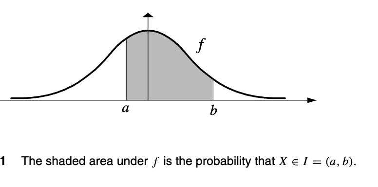
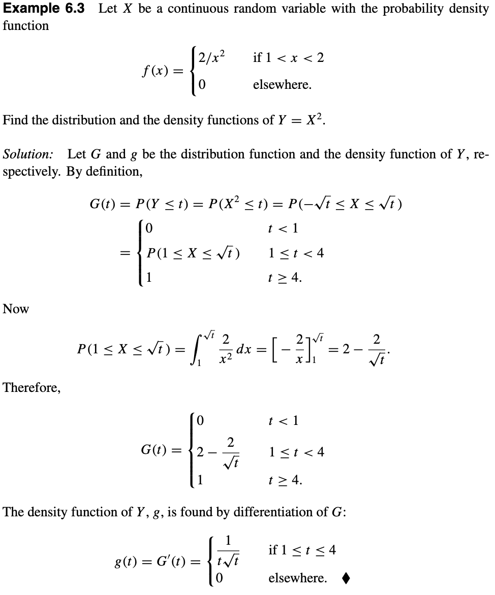

## Probability Density Functions

!!! note "Definition"
    Let X be a random variable. Suppose that there exists a nonnegative real-valued function $f:R\to [0,\infty)$ such that for any subset of real numbers A that can be constructed from intervals by a countable number of set operations, 
    $$P(X\in A)=\int_{A}f(x)dx.$$
    Then X is called **absolutely continuous** or **continuous**. The function f is called the **probability density function**, or simply the **density function** of X.

Discrete random variables 是某个X对应映射一个x，再对应具体的p(x).(see [Distribution Functions and Discrete Random Variables](../4. Distribution Functions and Discrete Random Variables/#discrete-random-variables))
### Properties:
1. $F(t)=\int_{-\infty}^{t}f(x)dx$.
   Let A = (−∞, t]; then  $$F(t)=P(X\le t)=P(X\in A)=\int_{-\infty}^{t}f(x)dx.$$
2. $\int_{-\infty}^{\infty}f(x)dx=1.$
3. If f is continuous, then $F^{'}(X)=f(x).$
4. For real numbers a ≤ b, $P(a\le X\le b)=\int_{a}^{b}f(x)dx.$
5. $P(a\lt X\lt b)=P(a\le X\lt b)=P(a\lt X\le b)=P(a\le X\le b)=\int_{a}^{b}f(x)dx.$
   

## Density Function of a function of a Random Variable

### The Method of distribution functions

***Example:***

- The method used to find the density function of h(X), a function of the random variable X (or as Y above), is to determine the distribution of h(X) and then differentiate it.
  $f(x)\to P(Y\le t)=G(t)\to g(t)=G^{'}(t)$

- It is also possible to find the density function of h(X) without obtaining its distribution function called the method of **transformations**.
  直接套公式

#### Theorem 6.1 (Method of Transformations)
Let X be a continuous random variable with density function $f_{X}$ and the set of possible values $A$. For the invertible function
$h:A\to R$ (映射解释查看 [Distribution Functions and Discrete Random Variables](../4. Distribution Functions and Discrete Random Variables/#random-variables)), let $Y=h(x)$ be a random variable with the set of possible values $B=h(A)={h(a):a\in A}.$ Suppose that the inverse of  $y=h(x)$ is the function $x=f^{-1}(y)$, which is differentiable for all values of $y\in B$. Then $f_{Y}$, the density function of $Y$ , is given by$$f_{Y}(y)=f_{X}(h^{-1}(y))|(h^{-1})^{'}(y)|,\:y\in B.$$

## Expectations And Variances

### Expectations of Continuous Random Variables

!!! note "Expectations of Continuous Random Variables"
    If X is a continuous random variable with probability density function f , the expected value of X is defined by$$\int_{-\infty}^{\infty}xf(x)dx.$$

If X is a continuous random variable with density function f , X is said to have a **finite expected value** if $$\int_{-\infty}^{\infty}|x|f(x)dx\lt\infty.$$
#### Theorem 6.2
For any continuous random variable $X$ with probability distribution function $F$ and density function $f$ ,$$E(X)=\int_{0}^{\infty}P(X\gt t)dt-\int_{0}^{\infty}P(X\le -t)dt.$$
$$\implies E(X)=\int_{0}^{\infty}[1-F(t)]dt-\int_{0}^{\infty}F(-t)dt.$$

#### Theorem 6.3
Let X be a continuous random variable with probability density function $f (x)$; then for any function $h : R → R$,$$E[h(X)]=\int_{-\infty}^{\infty}h(x)f(x)dx.$$
##### Corollary
Let X be a continuous random variable with probability density function $f (x)$. Let $h_{1}, h_{2}, . . . , h_{n}$ be real-valued functions, and $α_{1}, α_{2}, . . . , α_{n}$ be real numbers. Then $$E[\alpha_{1}h_{1}(X)+\alpha_{2}h_{2}(X)+...+\alpha_{n}h_{n}(X)]=\alpha_{1}E[h_{1}(X)]+\alpha_{2}E[h_{2}(X)]+...+\alpha_{n}E[h_{n}(X)]$$or$$E(\alpha X+\beta)=\alpha E(X)+\beta.$$

### Variances of Continuous Random Variables

!!! note "Definition"
    If X is a continuous random variable with $E(X) = μ$, then $Var(X)$ and $σ_{X}$, called the variance and standard deviation of X, respectively, are defined by $$Var(X)=E[(X-\mu)^{2}]=E(X^{2})-[E(X)]^{2}=\int_{-\infty}^{\infty}(x-\mu)^{2}f(x)dx.$$
