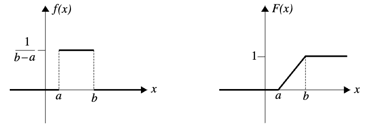
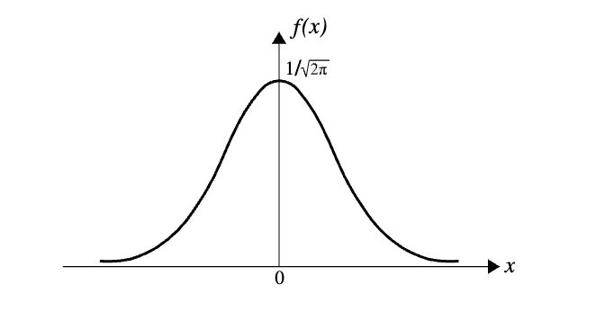

## Uniform Random Variables (均匀随机变量)

!!! note "Definition"
    A random variable X is said to be uniformly distributed over an interval $(a, b)$ if its probability density function is given by $$\begin{equation} p(x)=\left\{ \begin{array}{lr}c=\frac{1}{b-a},&if\; a\lt t\lt b\\0,&otherwise.\end{array} \right. \end{equation}$$

$$
\begin{equation} F(t)=\left\{ \begin{array}{lr}0,&t\lt a\\\frac{t-a}{b-a},&a\le t\lt b\\1,& t\ge b.
\end{array} \right. \end{equation}
$$

$$E(X)=\frac{a+b}{2},\,Var(X)=\frac{(b-a)^{2}}{12},\; \sigma_{X}=\frac{b-a}{\sqrt{12}}$$

## Normal Random Variables (正态随机变量)

#### De Moivre’s Theorem 
Let $X$ be a binomial random variable with parameters $n$ and $1/2$. Then for any numbers $a$ and $b$, $a < b$, $$\lim_{n\to\infty}P(a<\frac{X-\frac{1}{2}n}{\frac{1}{2}\sqrt{n}}<b)=\frac{1}{\sqrt{2\pi}}\int_{a}^{b}e^{-\frac{t^{2}}{2}}dt.$$
Note that in this formula $\frac{1}{2}n=E(X)$ and $\frac{1}{2}\sqrt{n}=\sigma_{X}$.
$\implies$ 
#### Theorem 7.1 (De Moivre-Laplace Theorem)
Let $X$ be a binomial random variable with parameters $n$ and $1/2$. Then for any numbers $a$ and $b$, $a < b$,$$\lim_{n\to\infty}P(a<\frac{X-np}{\sqrt{np(1-p)}}<b)=\frac{1}{\sqrt{2\pi}}\int_{a}^{b}e^{-\frac{t^{2}}{2}}dt.$$
Note that $np=E(X)$ and $\sqrt{np(1-p)}=\sigma_{X}$.

!!! tip
    Poisson’s approximation, as discussed, is good when n is large, $p$ is relatively small, and np is appreciable. The De Moivre-Laplace formula yields excellent approximations for values of $n$ and $p$ for which $np(1 − p) ≥ 10$.

!!! note "Definition"
    A random variable $X$ is called ***standard normal*** if its distribution function is $\phi$, that is, if$$F(t)=P(X\le t)=\phi (t)=\frac{1}{\sqrt{2\pi}}\int_{-\infty}^{t}e^{-\frac{x^{2}}{2}}dx$$
    注意：这是关于$t$的函数.$$f(x)=\phi ^{'}(t)=\frac{1}{\sqrt{2\pi}}e^{-\frac{x^{2}}{2}}.$$

## Exponential Random Variables （指数随机变量）

Let $X_{1}$ be the time of the first event, $X_{2}$ be the elapsed time between the first and the second events, $X_{3}$ be the elapsed time between the second and third events, and so on. The sequence of random variables $\left\{X_{1}, X_{2}, X_{3}, . . . \right\}$ is called the sequence of interarrival times of the **Poisson process** in [Special Discrete Distributions](../5. Special Discrete Distributions/#poisson-processes).
For $t\ge 0$,$$P(X_{1}\gt t)=P(N(t)=0)=e^{-\lambda t}.$$
Therefore,$$P(X_{1}\le t)=1-P(X_{1}\gt t)=1-e^{-\lambda t}$$
Let $$
\begin{equation} F(t)=\left\{ \begin{array}{lr}1-e^{-\lambda t}&t\ge 0\\0&t\lt0
\end{array} \right. \end{equation}
$$
for some λ > 0. Then F is the distribution function of $X_{n}$ for all n ≥ 1. It is called **exponential distribution** and is one of the most important distributions of pure and applied probability. 

!!! note "Definition"
    A continuous random variable X is called exponential with parameter λ > 0 if its density function is given by$$
    \begin{equation} f(t)=F^{'}(t)=\left\{ \begin{array}{lr}\lambda e^{-\lambda t}&t\ge 0\\0&t\lt 0
    \end{array} \right. \end{equation}
    $$

* Because the interarrival times of a Poisson process are exponential, the following are examples of random variables that might be exponential.
1. The interarrival time between two customers at a post office 
2. The duration of Jim’s next telephone call 
3. The time between two consecutive earthquakes in California
4. The time until the next baby is born in a hospital

From [Special Discrete Distributions](../5. Special Discrete Distributions/#poisson-processes) we know that λ is the average number of the events in one time unit; that is, $E[N(1)] = λ$. Therefore, we should expect an average time ***1/λ*** between two consecutive events. To prove this, let X be an exponential random variable with parameter λ; then$$E(X)=\int_{-\infty}^{\infty}xf(x)dx=\int_{0}^{\infty}x(\lambda e^{-\lambda x})dx.$$
Using integration by parts with $u = x$ and $dv = λe^{−λx}dx$, we obtain$$E(X)=[-xe^{-\lambda x}]_{0}^{\infty}+\int_{0}^{\infty}e^{-\lambda x}dx=0-[\frac{1}{\lambda}e^{-\lambda x}]_{0}^{\infty}=\frac{1}{\lambda}$$
Similarly, we obtain$$Var(X)=E(X^{2})-[E(X)]^{2}=\frac{2}{\lambda ^{2}}-\frac{1}{\lambda^{2}}=\frac{1}{\lambda^{2}}$$
## Gamma Distributions

## Beta Distributioins
