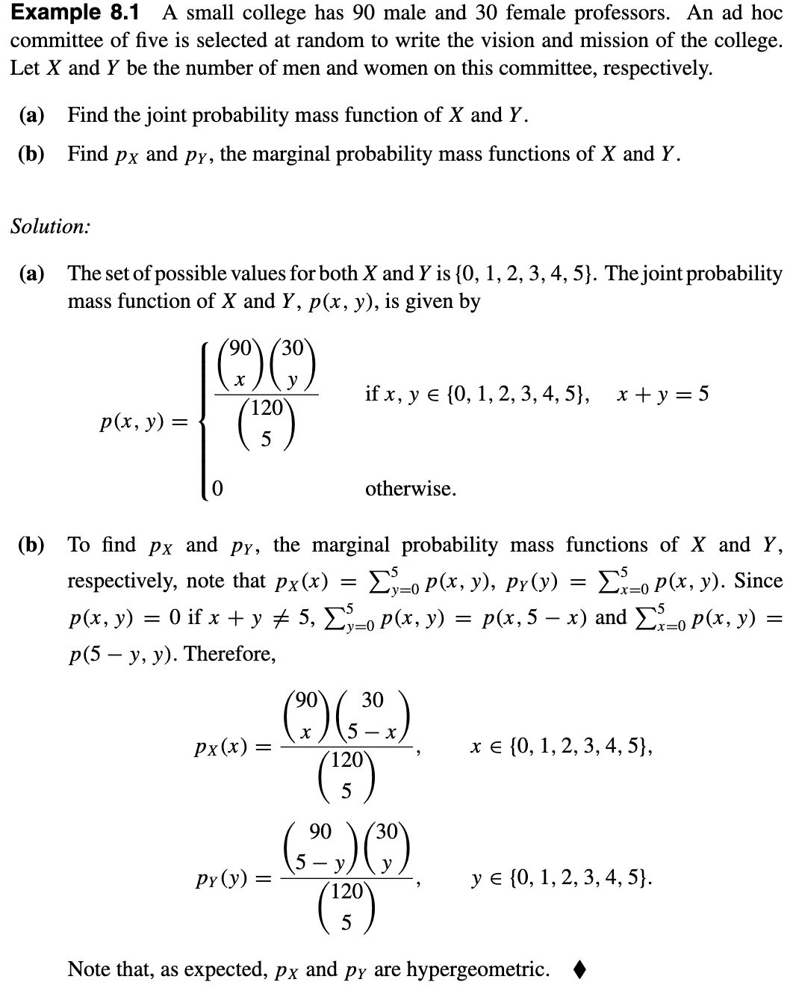

## Joint Distribution of Two Random Variables
### Joint Probability Mass Functions

!!! note "Definition 1"
    Let X and Y be two discrete random variables defined on the same sample space. Let the sets of possible values of X and Y be A and B, respectively. The function$$p(x,y)=P(X=x,Y=y)$$
    is called the **joint probability mass function** of X and Y.

Note that $p(x,y)\ge 0.$ if $x\notin A$ or $y \notin B$, then $p(x,y)=0.$ Also,$$\sum_{x\in A}\sum_{y\in B}p(x,y)=1.$$
Let X and Y have joint probability mass function p(x, y). Let $p_{X}$ be the probability mass function of X. Then$$p_{X}(x)=P(X=x)=P(X=x,Y\in B)=\sum_{y\in B}P(X=x,Y=y)=\sum_{y\in B}p(x,y)$$Similarly, $$p_{Y}(y)=\sum_{x \in A}p(x,y)$$These relations motivate the following definition.

!!! note "Definition 2"
    Let X and Y have joint probability mass function $p(x, y)$. Let A be the set of possible values of X and B be the set of possible values of Y . Then the functions $p_{X}(x)=\sum_{y \in B}p(x,y)$ and $p_{Y}(y)=\sum_{x \in A}p(x,y)$ are called, respectively, the **marginal probability mass functions** of X and Y .

$$E(X)=\sum_{x\in A}xp(x);\;E(Y)=\sum_{y\in B}yp_{Y}(y).$$
***Example:***

#### Theorem 8.1 
Let $p(x, y)$ be the joint probability mass function of discrete random variables X and Y . Let A and B be the set of possible values of X and Y , respectively. If h is a function of two variables from $R^{2}$ to $R$ , then $h(X, Y )$ is a discrete random variable with the expected value given by$$E[h(X,Y)]=\sum_{x\in A}\sum_{y\in B}h(x,y)p(x,y),$$provided that the sum is absolutely convergent.

##### Corollary 
For discrete random variables X and Y ,$$E(X+Y)=E(X)+E(Y).$$***Proof:*** In Theorem 8.1 let $h(x, y) = x + y.$ Then$$E(X+Y)=\sum_{x\in A}\sum_{y\in B}(x+y)p(x,y)=\sum_{x\in A}\sum_{y\in B}xp(x,y)+\sum_{x\in A}\sum_{y\in B}yp(x,y)=E(X)+E(Y).$$

### Joint Probability Density Functions

!!! note "Definition"
    Two random variables $X$ and $Y$ , defined on the same sample space, have a continuous joint distribution if there exists a nonnegative function of two variables, $f (x, y)$ on $R × R$ , such that for any region $R$ in the xy-plane that can be formed from rectangles by a countable number of set operations,$$P((X,Y)\in R)=\int\int_{R}f(x,y)dx\,dy$$The function $f (x, y)$ is called the **joint probability density function** of $X$ and $Y$ . 
