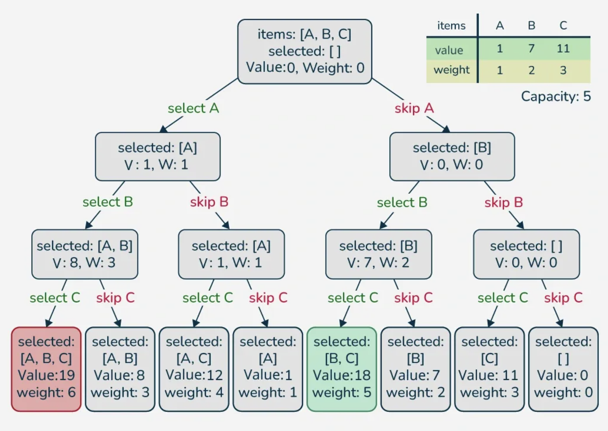
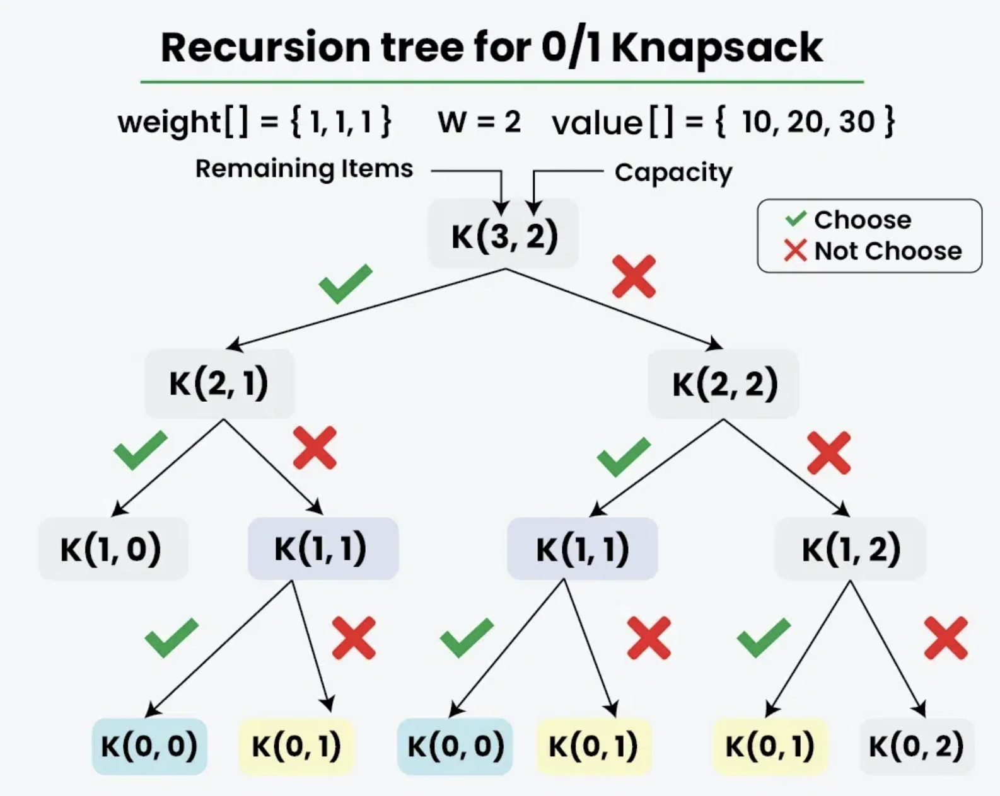

Given *n* items where each item has some weight and profit associated with it and also given a bag with capacity *W*, i.e., the bag can hold at most *W* weight in it. The task is to put the items into the bag such that the sum of profits associated with them is the maximum possible. 

???+ warning "**Note:**"
    The constraint here is we can either put an item completely into the bag or cannot put it at all [It is not possible to put a part of an item into the bag].

### Naive Aproach


???+ warning "**Note**:"
    The above function using recursion computes the same subproblems again and again


### [Better Approach 1] Using Top-Down DP (Memoization)- O(n x W) Time and Space

If we get a subproblem the first time, we can solve this problem by creating a 2-D array that can store a particular state (n, w). Now if we come across the same state (n, w) again instead of calculating it i again we can directly return its result stored in the table in constant time.
```python
# Returns the maximum value that
# can be put in a knapsack of capacity W
def knapsackRec(W, val, wt, n, memo):

    # Base Case
    if n == 0 or W == 0:
        return 0

    # Check if we have previously calculated the same subproblem
    if memo[n][W] != -1:
        return memo[n][W]

    pick = 0

    # Pick nth item if it does not exceed the capacity of knapsack
    if wt[n - 1] <= W:
        pick = val[n - 1] + knapsackRec(W - wt[n - 1], val, wt, n - 1, memo)

    # Don't pick the nth item
    notPick = knapsackRec(W, val, wt, n - 1, memo)

    # Store the result in memo[n][W] and return it
    memo[n][W] = max(pick, notPick)
    return memo[n][W]

def knapsack(W, val, wt):
    n = len(val)

    # Memoization table to store the results
    memo = [[-1] * (W + 1) for _ in range(n + 1)]

    return knapsackRec(W, val, wt, n, memo)

if __name__ == "__main__":
    val = [1, 2, 3]
    wt = [4, 5, 1]
    W = 4

    print(knapsack(W, val, wt))
```
output:
`3`


### [Better Approach 2] Using Bottom-Up DP (Tabulation) - O(n x W) Time and Space
There are two parameters that change in the recursive solution and these parameters go from 0 to n and 0 to W. So we create a 2D dp[][] array of size (n+1) x (W+1), such that dp[i][j] stores the maximum value we can get using i items such that the knapsack capacity is j.
- We first fill the known entries when m is 0 or n is 0.
- Then we fill the remaining entries using the recursive formula.

For each item i and knapsack capacity j, we decide whether to pick the item or not.
- **If we don't pick the item:** dp[i][j] remains same as the previous item, that is dp[i - 1][j].
- **If we pick the item:** dp[i][j] is updated to val[i] + dp[i - 1][j - wt[i]].
```python
def knapsack(W, val, wt):
    n = len(wt)
    dp = [[0 for _ in range(W + 1)] for _ in range(n + 1)]

    # Build table dp[][] in bottom-up manner
    for i in range(n + 1):
        for j in range(W + 1):

            # If there is no item or the knapsack's capacity is 0
            if i == 0 or j == 0:
                dp[i][j] = 0
            else:
                pick = 0

                # Pick ith item if it does not exceed the capacity of knapsack
                if wt[i - 1] <= j:
                    pick = val[i - 1] + dp[i - 1][j - wt[i - 1]]

                # Don't pick the ith item
                notPick = dp[i - 1][j]

                dp[i][j] = max(pick, notPick)

    return dp[n][W]

if __name__ == "__main__":
    val = [1, 2, 3]
    wt = [4, 5, 1]
    W = 4
    
    print(knapsack(W, val, wt))
```
output:
`3`


### [Expected Approach] Using Bottom-Up DP (Space-Optimized) - O(n x W) Time and O(W) Space
> For calculating the current row of the dp[] array we require only previous row, but if we start traversing the rows from right to left then it can be done with a single row only

```python
# Function to find the maximum profit
def knapsack(W, val, wt):
    
    # Initializing dp list
    dp = [0] * (W + 1)

    # Taking first i elements
    for i in range(1, len(wt) + 1):
        
        # Starting from back, so that we also have data of
        # previous computation of i-1 items
        for j in range(W, wt[i - 1] - 1, -1):
            dp[j] = max(dp[j], dp[j - wt[i - 1]] + val[i - 1])
    
    return dp[W]

if __name__ == "__main__":
    val = [1, 2, 3]
    wt = [4, 5, 1]
    W = 4

    print(knapsack(W, val, wt))
```
output: 
`3`

